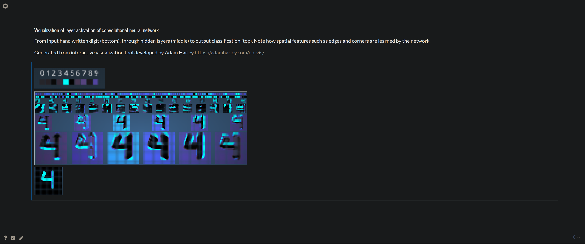

# Knowledge share Neural Networks
## Setup
### Clone and browse repo
```
git clone git@github.com:johndah/Intro-to-Machine-Learning.git
cd Intro-to-Machine-Learning
jupyter notebook
```
### Dependencies
```
pip install notebook pandas networkx matplotlib scikit-learn
sudo apt-get install python3-tk
```
Optional dependency for interactive slides
```
pip install rise
```

## Slides



