<script type="text/x-mathjax-config">
MathJax.Hub.Config({
tex2jax: {
inlineMath: [['$','$'], ['\\(','\\)']],
processEscapes: true},
jax: ["input/TeX","input/MathML","input/AsciiMath","output/CommonHTML"],
extensions: ["tex2jax.js","mml2jax.js","asciimath2jax.js","MathMenu.js","MathZoom.js","AssistiveMML.js", "[Contrib]/a11y/accessibility-menu.js"],
TeX: {
extensions: ["AMSmath.js","AMSsymbols.js","noErrors.js","noUndefined.js"],
equationNumbers: {
autoNumber: "AMS"
}
}
});
</script>

```python
dark_theme = True # Requires dark theme editor or browser, e.g. Dark Reader extension on Chrome
```


```python
def hide_input_code():   
    from IPython import display
    import binascii
    import os
    uid = binascii.hexlify(os.urandom(8)).decode()    
    html = """<div id="%s"></div>
    <script type="text/javascript">
        $(function(){
            var p = $("#%s");
            if (p.length==0) return;
            while (!p.hasClass("cell")) {
                p=p.parent();
                if (p.prop("tagName") =="body") return;
            }
            var cell = p;
            cell.find(".input").addClass("hide-in-slideshow")
        });
    </script>""" % (uid, uid)
    display.display_html(html, raw=True)

```


```python
%%html
<style>
 .container.slides .celltoolbar, .container.slides .hide-in-slideshow {
    display: None ! important;
}
</style>
```


<style>
 .container.slides .celltoolbar, .container.slides .hide-in-slideshow {
    display: None ! important;
}
</style>


```javascript
%%javascript
 MathJax.Hub.Config({
    TeX: { equationNumbers: { autoNumber: "AMS" } }
});
MathJax.Hub.Queue(
    ["resetEquationNumbers", MathJax.InputJax.TeX],
    ["PreProcess", MathJax.Hub],
    ["Reprocess", MathJax.Hub]
);
```


    <IPython.core.display.Javascript object>


## Neural Networks

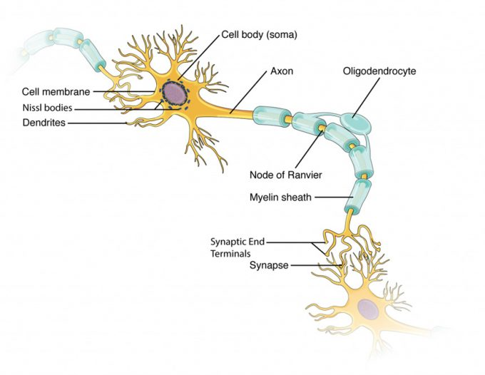


```python
from IPython.display import Latex, HTML, Markdown
hide_input_code()


Markdown('''
Biological neuron, where memory is hypothesized to be stored in synapses, and affects whether input impulses fire an output spike.  
Figure is from Figure 12.22 in Anatomy & Physiology. (Leeah Whittier, 2019)
''')
```


<div id="3cf995b496b14b74"></div>
    <script type="text/javascript">
        $(function(){
            var p = $("#3cf995b496b14b74");
            if (p.length==0) return;
            while (!p.hasClass("cell")) {
                p=p.parent();
                if (p.prop("tagName") =="body") return;
            }
            var cell = p;
            cell.find(".input").addClass("hide-in-slideshow")
        });
    </script>


Biological neuron, where memory is hypothesized to be stored in synapses, and affects whether input impulses fire an output spike.  
Figure is from Figure 12.22 in Anatomy & Physiology. (Leeah Whittier, 2019)


```python
import pandas as pd
import networkx as nx
import matplotlib.pyplot as plt

hide_input_code()

def plot_artificial_neuron():
    plt.figure(figsize=(9, 6))

    input_neurons = [r'$x_1$', r'$x_2$', r'$\vdots$', r'$x_n$', r'$x_b \equiv1$']
    output_neurons = [r'$y = a(\mathbf{w^T x})$']*len(input_neurons)

    df = pd.DataFrame({'input_neurons': input_neurons,
                       'output_neurons': output_neurons})

    scale = .3
    pos = {input_neurons[0]: (1, 5*scale),
           input_neurons[1]: (1, 4*scale),
           input_neurons[2]: (1, 3*scale),
           input_neurons[3]: (1, 2*scale),
           input_neurons[4]: (1, 1*scale),
           output_neurons[0]: (3, 3*scale)}

    labels = dict(zip(pos.keys(), pos.keys()))

    G = nx.from_pandas_edgelist(df,
                                'input_neurons',
                                'output_neurons',
                                create_using=nx.DiGraph())

    G = nx.restricted_view(G, [],  [(input_neurons[2],  output_neurons[0])])
    nodes = nx.draw_networkx_nodes(G, pos,
                                   nodelist=G.nodes,
                                   node_size=1.e4,
                                   node_shape='o',
                                   node_color='orange',
                                   alpha=[0, 1, 0, 0, 0, 0])

    nx.draw_networkx_labels(G, pos, labels, font_size=18, font_color='black')

    edges = nx.draw_networkx_edges(G, pos, node_size=1.e4,
                                   arrowstyle='->',
                                   edge_color='orange',
                                   width=4,)

    nx.draw_networkx_edge_labels(G, pos, bbox=dict(facecolor='none', edgecolor='none'),
                                 font_size=20,
                                 font_color='orange',
                                 label_pos=.65,
                                 verticalalignment='bottom',
                                 edge_labels={(input_neurons[0], output_neurons[0]): r'$w_1$',
                                              (input_neurons[1], output_neurons[1]): r'$w_2$',
                                              (input_neurons[2], output_neurons[2]): '',
                                              (input_neurons[3], output_neurons[3]): r'$w_n$',
                                              (input_neurons[4], output_neurons[4]): r'$-w_b$'})

    plt.xlim(0, 4)
    plt.ylim(0, 2)
    plt.axis('off')
    
plot_artificial_neuron()
plt.show()
Markdown('''
Artificial neuron, where memory is stored in weights $\mathbf{w}$ and affects how inputs $\mathbf{x}$ propagates to output $y$. 
''')
```


<div id="972e9ecf298476c0"></div>
    <script type="text/javascript">
        $(function(){
            var p = $("#972e9ecf298476c0");
            if (p.length==0) return;
            while (!p.hasClass("cell")) {
                p=p.parent();
                if (p.prop("tagName") =="body") return;
            }
            var cell = p;
            cell.find(".input").addClass("hide-in-slideshow")
        });
    </script>


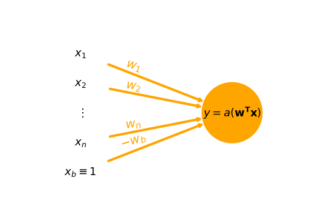


Artificial neuron, where memory is stored in weights $\mathbf{w}$ and affects how inputs $\mathbf{x}$ propagates to output $y$. 


Hebbs rule: <em>Neurons that fire together, wire together</em>

### Logical AND Problem


```python
from matplotlib.ticker import MaxNLocator
import numpy as np
%matplotlib inline

hide_input_code()

def get_figure(size=(8, 8)):
    fig = plt.figure(figsize=size)
    ax = fig.gca()
    ax.set_axisbelow(True)
    plt.grid(linewidth=.2 if dark_theme else .7)
    
    if dark_theme:
        ax.patch.set_alpha(0.)
        label_color = 'white'
        ax.set_title(ax.get_title(), color=label_color)
        

        [ax.spines[spine].set_color(label_color) for spine in ax.spines]
        ax.xaxis.label.set_color(label_color)
        ax.yaxis.label.set_color(label_color)
        ax.tick_params(axis='x', colors=label_color)
        ax.tick_params(axis='y', colors=label_color)
    
    return ax
    

def plot_problem(ax, data, targets, limits=[-.25, 1.25, -.25, 1.25], title=''):
    for sample_index in range(len(data)):
        sample_input = data[sample_index].astype(int)
        ground_truth = targets[sample_index]

        if ground_truth: # If output is True
            sample_marker = 'P'
            sample_color = 'limegreen'
        else:
            sample_marker = 'X'
            sample_color = 'r'
            
        plt.plot(sample_input[0],
                sample_input[1],
                sample_marker,
                color=sample_color,
                markersize=13,
                label=ground_truth)
    plt.axis('equal')
   
    plt.xlabel(r'$x_1$')
    plt.ylabel(r'$x_2$')
    handles, labels = ax.get_legend_handles_labels()
    legends = [(h, l) for i, (h, l) in enumerate(zip(handles, labels)) if l not in labels[:i]]
    ax.legend(*zip(*legends))
    plt.title(title)
    
    
    ticks = np.arange(limits[0], 2*limits[1], .25)
    tick_labels = [str(tick) for tick in ticks]
    tick_labels[np.where(ticks == 0)[0][0]] += '\n(False)'
    tick_labels[np.where(ticks == 1)[0][0]] += '\n(True)'
    ax.set_yticks(ticks)
    ax.set_yticklabels(tick_labels)
    ax.set_xticks(ticks)
    ax.set_xticklabels(tick_labels)
    plt.axis(limits)
    
    return legends

```


<div id="5cb0de86afb8c0bc"></div>
    <script type="text/javascript">
        $(function(){
            var p = $("#5cb0de86afb8c0bc");
            if (p.length==0) return;
            while (!p.hasClass("cell")) {
                p=p.parent();
                if (p.prop("tagName") =="body") return;
            }
            var cell = p;
            cell.find(".input").addClass("hide-in-slideshow")
        });
    </script>


```python
ax = get_figure()

data = [np.array([False, False]),
        np.array([True,  False]),
        np.array([False, True]),
        np.array([True,  True])]

targets = [False,
           False,
           False,
           True]

legends = plot_problem(ax, data, targets)
plt.show()
```


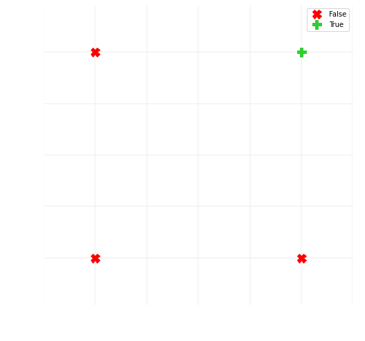


### Solving the problem geometrically


```python
hide_input_code()

def plot_vector(position, direction, color, text='', width=.009, scalar=False, dx_text=0., dy_text=0.):
    if scalar:
        width=.006
        plt.quiver(direction[0], direction[1], -direction[0], -direction[1], color=color, angles='xy', scale_units='xy', scale=1, width=width)
    
    plt.quiver(position[0], position[1], direction[0], direction[1], color=color, angles='xy', scale_units='xy', scale=1, width=width)
    plt.text(position[0]+direction[0]/2+dx_text, position[1]+direction[1]/2-.06+dy_text, text, color=color, fontsize=14)

def plot_classification(ax,
                        data,
                        targets,
                        weights,
                        limits=[-.25, 1.7, -.25, 1.7],
                        normal_color='navy',
                        line_color='mediumslateblue',
                        bias_color='darkorange',
                        fill_alpha=.4):
    if not dark_theme:
        normal_color = 'darkgreen'
    
    normal = np.atleast_2d(weights[:2]).T
    bias = -weights[-1]
    
    legends = plot_problem(ax, data, targets, limits)
    
    bias_vec = bias * normal / np.linalg.norm(normal)
    
    bias_text = r"bias $w_b = %s$"%(np.round(bias, 2))
    plot_vector(np.zeros(2), bias_vec, color=bias_color, text=bias_text, scalar=True)
    
    # Parameterization
    ax_limits = np.array([2, 2]).T
    line_direction = np.array([normal[1], -normal[0]])
    x_lim = np.max(np.abs((-bias_vec.T + ax_limits)/line_direction))
    t = np.array([-x_lim, x_lim])*2
    classification_line = line_direction * t + bias_vec
    classification_plot = plt.plot(classification_line[0],
                                   classification_line[1],
                                   linewidth=2, 
                                   color=line_color)
    fill_extreme_value_max = np.max(classification_line[1]+2) if np.sum(normal) >= 0 else \
                             np.min(classification_line[0]-2)
    fill_extreme_value_min = np.min(classification_line[0]-2) if np.sum(normal) >= 0 else \
                             np.max(classification_line[1]+2)
        
    plt.fill_between(classification_line[0],
                     classification_line[1],
                     fill_extreme_value_max, 
                     alpha=fill_alpha, color='limegreen')
    
    plt.fill_between(classification_line[0],
                     classification_line[1],
                     fill_extreme_value_min, 
                     alpha=fill_alpha*.5 if dark_theme else 0, color='red')

    normal_text = r"normal $\mathbf{w_{n}} = (%s, %s)^T$"%(np.round(normal[0][0], 2), np.round(normal[1][0], 2))
    plot_vector(bias_vec, normal, color=normal_color, text=normal_text, dx_text=-.02, dy_text=-.02)
    
    legends.append((classification_plot[0], 'Classification line'))
    plt.legend(*zip(*legends))
    plt.axis(limits)

```


<div id="3ac75e1484fcb668"></div>
    <script type="text/javascript">
        $(function(){
            var p = $("#3ac75e1484fcb668");
            if (p.length==0) return;
            while (!p.hasClass("cell")) {
                p=p.parent();
                if (p.prop("tagName") =="body") return;
            }
            var cell = p;
            cell.find(".input").addClass("hide-in-slideshow")
        });
    </script>


To solve the problem geomerically, lets define a classification line with some normal $\mathbf{w_n}$ respectively bias $w_b$


```python
normal = np.atleast_2d([.5, .5]).T
w_b = 1.

weights = np.append(normal, -w_b)

ax = get_figure()
plot_classification(ax, data, targets, weights)
```


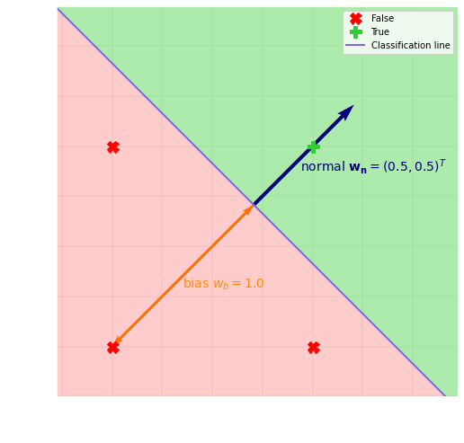


```python
hide_input_code()

ax = get_figure()
plot_classification(ax, data, targets, weights)

sample_index = 2
sample = data[sample_index].astype(int)

normalization_factor = 1 / np.linalg.norm(normal)
projected_sample_distance = (normal.T @ sample)[0] * normalization_factor
weighted_sum = projected_sample_distance - w_b

sample_text = r"sample $\mathbf{x_%s} = (%s, %s)^T$"%(sample_index, sample[0], sample[1])
plot_vector(np.zeros(2), sample, color='dodgerblue' if dark_theme else 'blue', text=sample_text, dy_text=.2)
    
projected_sample = projected_sample_distance * np.sqrt(2)* normal
projected_sample_text = r"projected sample distance"'\n'"$\mathbf{w_{n}^T} \mathbf{x_2} = %s$"%np.round(projected_sample_distance, 2)
plot_vector(np.zeros(2),
            projected_sample,
            color='lightseagreen' if dark_theme else 'purple',
            text=projected_sample_text, 
            scalar=True,
            dy_text=-.06)

projection = np.concatenate((np.atleast_2d(sample), projected_sample.T)).T
plt.plot(projection[0], projection[1], '--', color='lightseagreen' if dark_theme else 'purple', linewidth=1)


Latex('''
Consider some sample e.g. $\\mathbf{x_2}$ 

Projecting it onto $\\frac{\mathbf{w_{n}}}{||\\mathbf{w_{n}}||}$, and subtracting with the bias $w_b$, gives weighted sum

\\begin{align}
s_2 &= \\frac{1}{||\\mathbf{w_{n}}||}\mathbf{w_{n}^T} \\mathbf{x_2} - w_b \\\ 
&= \\frac{1}{\\sqrt{w_1^2 + w_2^2}} \\begin{pmatrix} w_1 & w_2\\end{pmatrix} \\begin{pmatrix} x_1\\\ x_2\\end{pmatrix} - w_b\\\ 
&= \\underbrace{%s \cdot \\begin{pmatrix} 0.5 & 0.5 \\end{pmatrix} \\begin{pmatrix} 0 \\\ 1 \\end{pmatrix}}_{%s} - 1 \\\ 
&= %s
\\end{align}

that is, the distance to the classification line. Finally, let the prediction

\\begin{equation}
y = a(s) = \\begin{cases} 1, \\text{ if } s \\geq 0,\\\ 0 \\text{ otherwise}
\\end{cases}
\\end{equation}

determine the classification. Sample $\\mathbf{x_2}$ would thus be predicted as
\\begin{equation}
y_2 = a(s_2) = \\left\\{s_2 = %s \\ngeq 0 \\right\\} = 0, 
\\end{equation}
that is $false$, as expected.
'''%tuple(np.round(np.array([normalization_factor, projected_sample_distance, weighted_sum, weighted_sum]), 2))
)

```


<div id="51565ebeaf13fdc4"></div>
    <script type="text/javascript">
        $(function(){
            var p = $("#51565ebeaf13fdc4");
            if (p.length==0) return;
            while (!p.hasClass("cell")) {
                p=p.parent();
                if (p.prop("tagName") =="body") return;
            }
            var cell = p;
            cell.find(".input").addClass("hide-in-slideshow")
        });
    </script>


Consider some sample e.g. $\mathbf{x_2}$ 

Projecting it onto $\frac{\mathbf{w_{n}}}{||\mathbf{w_{n}}||}$, and subtracting with the bias $w_b$, gives weighted sum
$$
\begin{aligned}
s_2 &= \frac{1}{||\mathbf{w_{n}}||}\mathbf{w_{n}^T} \mathbf{x_2} - w_b \\ 
&= \frac{1}{\sqrt{w_1^2 + w_2^2}} \begin{pmatrix} w_1 & w_2\end{pmatrix} \begin{pmatrix} x_1\\ x_2\end{pmatrix} - w_b\\ 
&= \underbrace{1.41 \cdot \begin{pmatrix} 0.5 & 0.5 \end{pmatrix} \begin{pmatrix} 0 \\ 1 \end{pmatrix}}_{0.71} - 1 \\ 
&= -0.29
\end{aligned}
$$
that is, the distance to the classification line. Finally, let the prediction
$$
\begin{aligned}
y = a(s) = \begin{cases} 1, \text{ if } s \geq 0,\\ 0 \text{ otherwise}
\end{cases}
\end{aligned}
$$

determine the classification. Sample $\mathbf{x_2}$ would thus be predicted as
$$
\begin{aligned}
y_2 = a(s_2) = \left\{s_2 = -0.29 \ngeq 0 \right\} = 0, 
\end{aligned}
$$
that is $false$, as expected.


```python
hide_input_code()

sample_index = 3
sample = data[sample_index].astype(int)
projected_sample_distance = (normal.T @ sample)[0] * normalization_factor
weighted_sum = projected_sample_distance - w_b

Latex('''
Lets instead classify sample $\\mathbf{x_3} = \\begin{pmatrix} 1\\\ 1\\end{pmatrix}.$
The weighted sum

\\begin{align}
s_3 &= \\frac{1}{||\\mathbf{w_{n}}||} \\mathbf{w_{n}^T} \\mathbf{x_3} - w_b 
= \\underbrace{%s \cdot \\begin{pmatrix} 0.5 & 0.5 \\end{pmatrix} \\begin{pmatrix} 1 \\\ 1 \\end{pmatrix}}_{%s} - 1 \\\ 
&= %s \\geq 0 \\\ 
\\implies
y_3 &= 1
\\end{align} 
that is $true$, also as expected.
'''%tuple(np.round(np.array([normalization_factor, projected_sample_distance, weighted_sum]), 2))
)

```


<div id="e9050c313088c50e"></div>
    <script type="text/javascript">
        $(function(){
            var p = $("#e9050c313088c50e");
            if (p.length==0) return;
            while (!p.hasClass("cell")) {
                p=p.parent();
                if (p.prop("tagName") =="body") return;
            }
            var cell = p;
            cell.find(".input").addClass("hide-in-slideshow")
        });
    </script>


Lets instead classify sample $\mathbf{x_3} = \begin{pmatrix} 1\\ 1\end{pmatrix}.$
The weighted sum

$$
\begin{aligned}
s_3 &= \frac{1}{||\mathbf{w_{n}}||} \mathbf{w_{n}^T} \mathbf{x_3} - w_b 
= \underbrace{1.41 \cdot \begin{pmatrix} 0.5 & 0.5 \end{pmatrix} \begin{pmatrix} 1 \\ 1 \end{pmatrix}}_{1.41} - 1 \\ 
&= 0.41 \geq 0 \\ 
\implies
y_3 &= 1
\end{aligned} 
$$
that is $true$, also as expected.


Bringing in Neural Networks


```python
hide_input_code()

plot_artificial_neuron()
```


<div id="0ac7c724041cf47c"></div>
    <script type="text/javascript">
        $(function(){
            var p = $("#0ac7c724041cf47c");
            if (p.length==0) return;
            while (!p.hasClass("cell")) {
                p=p.parent();
                if (p.prop("tagName") =="body") return;
            }
            var cell = p;
            cell.find(".input").addClass("hide-in-slideshow")
        });
    </script>


```python
hide_input_code()

Latex('''
This activation can be previous indicator function
\\begin{align}
y = a(s) = \\begin{cases} 1, \\text{ if } s \\geq 0,\\\ 0 \\text{ otherwise} 
\\end{cases} 
\\end{align}

Lets simplify by collecting all parameters in weight $\\mathbf{w}$ and rewriting weighted sum 
\\begin{align}
s &= \\frac{1}{||\\mathbf{w_{n}}||}\mathbf{w_{n}^T} \\mathbf{x'} - w_b' \\\ 
&\\sim \mathbf{w_{n}^T} \\mathbf{x'} - w_b \\\ 
&= \\begin{pmatrix} w_1 & w_2 & \ldots & w_n \\end{pmatrix} \\begin{pmatrix} x_1\\\ x_2 \\\ \\vdots \\\ x_n \\end{pmatrix} - w_b\\\ 
&= \\begin{pmatrix} w_1 & w_2 & \ldots & w_n & -w_b \\end{pmatrix} \\begin{pmatrix} x_1\\\ x_2 \\\ \\vdots \\\ x_n \\\ 1 \\end{pmatrix}\\\ 
&= \mathbf{w^T} \\mathbf{x} 
\\end{align}
''')

```


<div id="d33b994216f761af"></div>
    <script type="text/javascript">
        $(function(){
            var p = $("#d33b994216f761af");
            if (p.length==0) return;
            while (!p.hasClass("cell")) {
                p=p.parent();
                if (p.prop("tagName") =="body") return;
            }
            var cell = p;
            cell.find(".input").addClass("hide-in-slideshow")
        });
    </script>


This activation can be previous indicator function
$$
\begin{aligned}
y = a(s) = \begin{cases} 1, \text{ if } s \geq 0,\\ 0 \text{ otherwise} 
\end{cases} 
\end{aligned}
$$

Lets simplify by collecting all parameters in weight $\mathbf{w}$ and rewriting weighted sum 
$$
\begin{aligned}
s &= \frac{1}{||\mathbf{w_{n}}||}\mathbf{w_{n}^T} \mathbf{x'} - w_b' \\ 
&\sim \mathbf{w_{n}^T} \mathbf{x'} - w_b \\ 
&= \begin{pmatrix} w_1 & w_2 & \ldots & w_n \end{pmatrix} \begin{pmatrix} x_1\\ x_2 \\ \vdots \\ x_n \end{pmatrix} - w_b\\ 
&= \begin{pmatrix} w_1 & w_2 & \ldots & w_n & -w_b \end{pmatrix} \begin{pmatrix} x_1\\ x_2 \\ \vdots \\ x_n \\ 1 \end{pmatrix}\\ 
&= \mathbf{w^T} \mathbf{x} 
\end{aligned}
$$


#### Our perceptron:


```python
import pandas as pd
import networkx as nx
from itertools import combinations

hide_input_code()

def plot_logical_and_nn(w_1=r'$w_0$', w_2=r'$w_1$', w_3=r'$-w_b$'):
    plt.figure(figsize=(12, 9))

    input_neurons = [r'$x_0$', r'$x_1$', r'$x_b \equiv1$']
    output_neurons = [r'$y = a(\mathbf{w^T x})$']*len(input_neurons)
    
    data_frame = {'input_neurons': input_neurons,
                  'output_neurons': output_neurons}
    
    pos = {input_neurons[0]: (1, 3),
           input_neurons[1]: (1, 2),
           input_neurons[2]: (1, 1),
           output_neurons[0]: (2, 2.5)}
    

    network = nx.from_pandas_edgelist(pd.DataFrame(data_frame),
                                      'input_neurons',
                                      'output_neurons',
                                       create_using=nx.DiGraph())

    edge_labels={(input_neurons[0], output_neurons[0]): w_1,
                 (input_neurons[1], output_neurons[1]): w_2,
                 (input_neurons[2], output_neurons[2]): w_3}

    labels = dict(zip(pos.keys(), pos.keys()))
    
    

    nodes = nx.draw_networkx_nodes(network, pos,
                                   nodelist=network.nodes,
                                   node_size=1.e4,
                                   node_shape='o',
                                   node_color='orange',
                                   alpha=1.)
    nx.draw_networkx_labels(nodes, pos, labels, font_size=18)
    
    edges = nx.draw_networkx_edges(network, pos, node_size=1.e4,
                                   arrowstyle='->',
                                   edge_color='orange',
                                   width=4)

    nx.draw_networkx_edge_labels(network, pos, bbox=dict(facecolor='none', edgecolor='none'),
                                 font_size=18,
                                 font_color='orange',
                                 label_pos=.6,
                                 verticalalignment='bottom',
                                 edge_labels=edge_labels)

    plt.xlim(0, 3)
    plt.ylim(0, 4)

    plt.axis('off')
    
plot_logical_and_nn(w_1=r'$w_0=\frac{\sqrt{2}}{2}$', w_2=r'$w_1=\frac{\sqrt{2}}{2}$', w_3=r'$-w_b=-1$')
```


<div id="cd3fb384fc222cc8"></div>
    <script type="text/javascript">
        $(function(){
            var p = $("#cd3fb384fc222cc8");
            if (p.length==0) return;
            while (!p.hasClass("cell")) {
                p=p.parent();
                if (p.prop("tagName") =="body") return;
            }
            var cell = p;
            cell.find(".input").addClass("hide-in-slideshow")
        });
    </script>


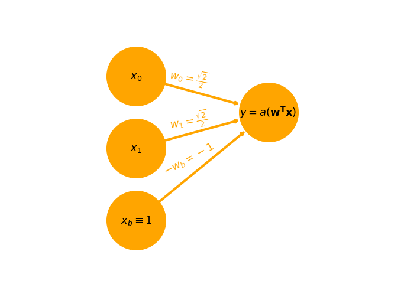


```python
hide_input_code()

def generate_random_weights(n_weights):
    np.random.seed(int(1e8)) # This seed provides a good example for visualization but can be arbitrary
    weights = np.random.randn(n_weights)

    normal = weights[:2]/np.linalg.norm(weights[:2])
    bias = weights[-1] 
    normalized_weights = np.append(normal, bias)
    
    return normalized_weights

Latex('''
How to choose weights? Lets randomly generate them:''')

```


<div id="e16bd2b49729891a"></div>
    <script type="text/javascript">
        $(function(){
            var p = $("#e16bd2b49729891a");
            if (p.length==0) return;
            while (!p.hasClass("cell")) {
                p=p.parent();
                if (p.prop("tagName") =="body") return;
            }
            var cell = p;
            cell.find(".input").addClass("hide-in-slideshow")
        });
    </script>


How to choose weights? Lets randomly generate them:


```python
weights = generate_random_weights(3)

plot_logical_and_nn(w_1=r'$w_1$=%s'%weights[0].round(2),
                    w_2=r'$w_2$=%s'%weights[1].round(2),
                    w_3=r'$w_3$=%s'%weights[2].round(2))

```


```python
hide_input_code()

sample_index = 2
sample = data[sample_index].astype(int)

sample_with_bias = np.append(sample, 1)
weighted_sum = (weights.T @ sample_with_bias)

Latex('''
As expected, the network performs bad, sample $x_1 = \\begin{pmatrix} 0 \\\ 1 \\\ 1 \\end{pmatrix}$ will be incorrectly classified as 
\\begin{align} 
y_1 &= a(s_1) = a\\left(\\mathbf{w^T} \\mathbf{x_1} \\right) 
=  a\\left( \\underbrace{\\begin{pmatrix} %s & %s & %s\\end{pmatrix} \\begin{pmatrix} %d \\\ %d \\\ %d \\end{pmatrix}}_{%s\\geq 0}\\right) \\\  
&= 1
\\end{align} 
that is $true$, while it should be $false$.
'''%tuple(np.round(np.concatenate((generate_random_weights(3), sample_with_bias, np.atleast_1d(weighted_sum))), 2))
)

```


<div id="4dafc1261b120937"></div>
    <script type="text/javascript">
        $(function(){
            var p = $("#4dafc1261b120937");
            if (p.length==0) return;
            while (!p.hasClass("cell")) {
                p=p.parent();
                if (p.prop("tagName") =="body") return;
            }
            var cell = p;
            cell.find(".input").addClass("hide-in-slideshow")
        });
    </script>


As expected, the network performs bad, sample $x_1 = \begin{pmatrix} 0 \\ 1 \\ 1 \end{pmatrix}$ will be incorrectly classified as 
$$
\begin{aligned} 
y_1 &= a(s_1) = a\left(\mathbf{w^T} \mathbf{x_1} \right) 
=  a\left( \underbrace{\begin{pmatrix} 0.29 & 0.96 & -0.68\end{pmatrix} \begin{pmatrix} 0 \\ 1 \\ 1 \end{pmatrix}}_{-1.12\geq 0}\right) \\  
&= 1
\end{aligned} 
$$
that is $true$, while it should be $false$.


```python
hide_input_code()

ax = get_figure()
plot_classification(ax, data, targets, generate_random_weights(3))

sample_text = r"sample $\mathbf{x_%s} = (%s, %s)^T$"%(sample_index, sample[0], sample[1])
plot_vector(np.zeros(2), sample, color='dodgerblue' if dark_theme else 'blue', text=sample_text)
 
plt.show()

```


<div id="b3687e1693c70776"></div>
    <script type="text/javascript">
        $(function(){
            var p = $("#b3687e1693c70776");
            if (p.length==0) return;
            while (!p.hasClass("cell")) {
                p=p.parent();
                if (p.prop("tagName") =="body") return;
            }
            var cell = p;
            cell.find(".input").addClass("hide-in-slideshow")
        });
    </script>


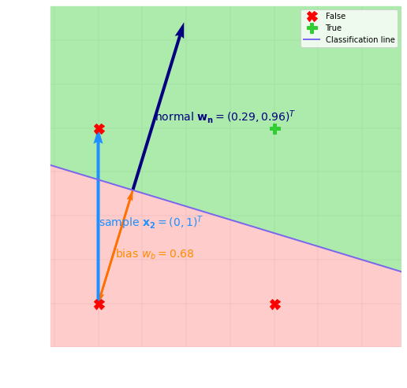


```python
from IPython.display import clear_output

def plot_delta_w(weights, delta_w, t, iterative=False, loss=None):
    ax = get_figure()
    
    bias_x = np.abs(weights[-1])*np.cos(np.arctan2(weights[1], weights[0]))
    plot_classification(ax, data, targets, weights, limits=[-.25, 1.4 + weights[0] + bias_x, -.25, 1.8])

    delta_w_text = r"$\Delta \mathbf{w}_{%d}$"%t + r"$ = (%s, %s)^T$"%tuple(delta_w.round(2)[:2])
    bias_vec = -weights[-1] * weights[:2] / np.linalg.norm(weights[:2])
    current_weight_position = bias_vec + weights[:2]
    plot_vector(current_weight_position, delta_w[:2], color='lightseagreen' if dark_theme else 'darkviolet', text=delta_w_text, dy_text=.1)
    
    if loss != None:
        plt.title(r'$\mathcal{L}_{%d} =$'%(t) + str(loss))
    
    if iterative:
        plt.pause(.001)
        clear_output(wait=True)

```


```python
hide_input_code()

weights = generate_random_weights(3)
learning_rate = 1

samples_with_bias = np.concatenate([np.array(data).T, np.ones((1, len(data)))])
y = np.array(weights.T @ samples_with_bias >= 0, int)
loss = np.sum((targets - y)**2)

delta_w = np.sum(learning_rate * (targets - y) * samples_with_bias, axis=1)

t = 2
plot_delta_w(weights, delta_w, t, loss=loss)
plot_vector(np.zeros(2), sample, color='dodgerblue' if dark_theme else 'blue', text=sample_text)
Latex('''
How to learn, i.e. decide change of weights $\Delta \mathbf{w_t}$ during update
\\begin{align}  
\mathbf{w_{t+1}} = \mathbf{w_t} + \Delta \mathbf{w_t} 
\\end{align}
at some timestep $t$? Can be done e.g. by $\\textbf{Perceptron Learning}$, i.e.
\\begin{align}
    \Delta \mathbf{w_t} &= \eta\\left(z_t - y_t\\right)\mathbf{x_t}
\\end{align}
where $\eta$ is the learning rate and $z$ is the target, e.g. ground truth. $\\\$

Note that updates
\\begin{align}
    \Delta \mathbf{w_{0, 1}} &= \eta\\underbrace{\\left(z_{0, 1} - y_{0, 1}\\right)}_{0}\mathbf{x_{0, 1}} = 0
\\end{align}
for correctly classified samples $\mathbf{x_{0}}, \mathbf{x_{1}}$.
Whereas for $\mathbf{x_{2}}$, using $\eta= %d$,
\\begin{align} 
    \Delta \mathbf{w_{2}} &= %d \cdot \\left(0 - 1\\right)  \\begin{pmatrix} %d \\\ %d \\\ %d \\end{pmatrix} 
    = \\begin{pmatrix} %d \\\ %d \\\ %d \\end{pmatrix} 
\\end{align}

'''%tuple(np.round(np.concatenate((np.atleast_1d([learning_rate]*2), sample_with_bias.astype(int), delta_w)), 2)))

```


<div id="e8746e169e65deb5"></div>
    <script type="text/javascript">
        $(function(){
            var p = $("#e8746e169e65deb5");
            if (p.length==0) return;
            while (!p.hasClass("cell")) {
                p=p.parent();
                if (p.prop("tagName") =="body") return;
            }
            var cell = p;
            cell.find(".input").addClass("hide-in-slideshow")
        });
    </script>


How to learn, i.e. decide change of weights $\Delta \mathbf{w_t}$ during update
$$
\begin{aligned}  
\mathbf{w_{t+1}} = \mathbf{w_t} + \Delta \mathbf{w_t} 
\end{aligned}
$$
at some timestep $t$? Can be done e.g. by $\textbf{Perceptron Learning}$, i.e.
$$
\begin{aligned}
    \Delta \mathbf{w_t} &= \eta\left(z_t - y_t\right)\mathbf{x_t}
\end{aligned}
$$
where $\eta$ is the learning rate and $z$ is the target, e.g. ground truth. $\\$

Note that updates
$$
\begin{aligned}
    \Delta \mathbf{w_{0, 1}} &= \eta\underbrace{\left(z_{0, 1} - y_{0, 1}\right)}_{0}\mathbf{x_{0, 1}} = 0
\end{aligned}
$$
for correctly classified samples $\mathbf{x_{0}}, \mathbf{x_{1}}$.
Whereas for $\mathbf{x_{2}}$, using $\eta= 1$,
$$
\begin{aligned} 
    \Delta \mathbf{w_{2}} &= 1 \cdot \left(0 - 1\right)  \begin{pmatrix} 0 \\ 1 \\ 1 \end{pmatrix} 
    = \begin{pmatrix} 0 \\ -1 \\ -1 \end{pmatrix} 
\end{aligned}
$$


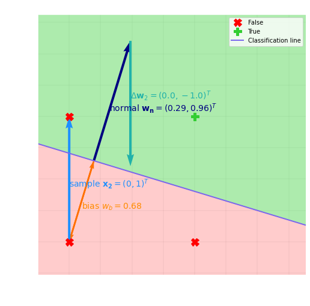


```python
def forward_perceptron_rule(x, targets):
    samples_with_bias = np.concatenate([np.array(data).T, np.ones((1, len(data)))])
    y = np.array(weights.T @ samples_with_bias >= 0, int)
    loss = np.sum((targets - y)**2)
    
    return y, loss

learning_rate = 1

y, loss = forward_perceptron_rule(data, targets)
delta_w = np.sum(learning_rate * (targets - y) * samples_with_bias, axis=1)

plot_delta_w(weights, delta_w, t, loss=loss)
weights += delta_w
t += 1

plt.show()
```


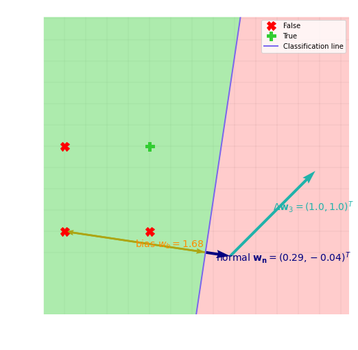

Note: multiple samples can be used to update weight simultaneously - here we use all four.

Not straight forward to choose learning rate. Instability if too large.

```python
weights = generate_random_weights(3)
learning_rate=2.8e-1
t = 0
```


```python
y, loss = forward_perceptron_rule(data, targets)
delta_w = np.sum(learning_rate * (targets - y) * samples_with_bias, axis=1)

plot_delta_w(weights, delta_w, t, loss=loss)
weights += delta_w
t += 1
```


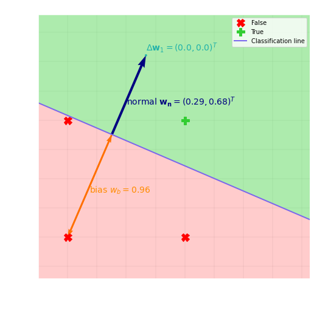

Converges better with small learning rate (not always true - can get stuck in local minima).

```python
hide_input_code()

get_figure(size=(8, 5))
lim = 5.
s = np.linspace(-lim, lim, 1000)

def step_function(s):
    return s >= 0

def sigmoid(s):
    return 1/(1 + np.exp(-s))

plt.axis([-lim, lim, -.5, 1.5])
plt.plot(s, step_function(s), label=r'$step(s)$')
plt.plot(s, sigmoid(s), label=r'$\sigma(s)$')
plt.xlabel(r'$s = \mathbf{w^T x}$')
plt.ylabel(r'$a(s)$')
plt.legend()

plt.show()

Latex('''
Problem - stops improving when eatch training sample is correctly classified. Boundary can be aribrarily close to samples.$\\\$ 
Due to binary step-activation function

\\begin{align}  
a(s) = \\begin{cases} 1, \\text{ if } s \\geq 0,\\\ 0 \\text{ otherwise} 
\\end{cases}
\\end{align} 

Instead, let activation

\\begin{align}  
a(s) &= \sigma(s) = \\dfrac{1}{1 + e^{-s}},
\\end{align} 
i.e. logistic function.
Quantify what it means to be wrong, using e.g. squared error as a loss function

\\begin{equation}
    \\mathcal{L_t} =  \\left(y_t - z_t\\right)^2, 
\\end{equation}
It's derivative
\\begin{align}  
\\dfrac{\partial \\mathcal{L_t}}{\partial \mathbf{w_t}} &= 2 \\left(y_t - z_t\\right) \\dfrac{\partial y_t}{\partial \mathbf{w_t}} \\\ 
 &= 2 \\left(a(s_t) - z_t\\right) \\dfrac{\partial a(s_t)}{\partial \mathbf{w_t}} 
  = \\left\{
        \\dfrac{\partial \sigma(s)}{\partial s} = \sigma(s) \\left(1- \sigma(s) \\right)
    \\right\} \\\ 
 &= 2 \\left(\sigma(s_t) - z_t\\right) \sigma(s_t) \\left(1- \sigma(s_t) \\right) \\dfrac{\partial s_t}{\partial \mathbf{w_t}} 
  = \\left\{
        \\dfrac{\partial s_t}{\partial \mathbf{w_t}} = \\dfrac{\partial \mathbf{w_t^T x_t}}{\partial \mathbf{w_t}} = \mathbf{x_t} 
    \\right\} \\\ 
 &= 2 \\left(\sigma(s_t) - z_t\\right) \sigma(s_t) \\left(1- \sigma(s_t) \\right) \mathbf{x_t} \\\ 
 %&= 2 \\left(\\dfrac{1}{1 + e^{-\mathbf{w_t^T x_t}}} - z_t\\right) \\dfrac{e^{\mathbf{w_t^T x_t}}}{\\left(1 + e^{\mathbf{w_t^T x_t}}\\right)^2} \mathbf{x_t} \\\ 

\\end{align} 

can be used to better update the weights, i.e. with $\\textbf{Stochastic Gradient Decent}$
\\begin{align}  
\mathbf{w_{t+1}} = \mathbf{w_t} - \\dfrac{\partial \\mathcal{L_t}}{\partial \mathbf{w_t}} \mathbf{w_t} 
\\end{align}
with objective to mimimize error $\\mathcal{L}$.
''')

```


<div id="52abfd8c7c4249c1"></div>
    <script type="text/javascript">
        $(function(){
            var p = $("#52abfd8c7c4249c1");
            if (p.length==0) return;
            while (!p.hasClass("cell")) {
                p=p.parent();
                if (p.prop("tagName") =="body") return;
            }
            var cell = p;
            cell.find(".input").addClass("hide-in-slideshow")
        });
    </script>


Problem - stops improving when eatch training sample is correctly classified. Boundary can be aribrarily close to samples.$\\$ 
Due to perceptron learning that uses binary step-activation function

$$
\begin{aligned}  
a(s) = \begin{cases} 1, \text{ if } s \geq 0,\\ 0 \text{ otherwise} 
\end{cases}
\end{aligned} 
$$

Instead, let activation

$$
\begin{aligned}  
a(s) &= \sigma(s) = \dfrac{1}{1 + e^{-s}},
\end{aligned} 
$$
i.e. logistic function.
Quantify what it means to be wrong, using e.g. squared error as a loss function

$$
\begin{aligned}
    \mathcal{L_t} =  \left(y_t - z_t\right)^2, 
\end{aligned}
$$
It's derivative
$$
\begin{aligned}  
\dfrac{\partial \mathcal{L_t}}{\partial \mathbf{w_t}} &= 2 \left(y_t - z_t\right) \dfrac{\partial y_t}{\partial \mathbf{w_t}} \\ 
 &= 2 \left(a(s_t) - z_t\right) \dfrac{\partial a(s_t)}{\partial \mathbf{w_t}} 
  = \left\{
        \dfrac{\partial \sigma(s)}{\partial s} = \sigma(s) \left(1- \sigma(s) \right)
    \right\} \\ 
 &= 2 \left(\sigma(s_t) - z_t\right) \sigma(s_t) \left(1- \sigma(s_t) \right) \dfrac{\partial s_t}{\partial \mathbf{w_t}} 
  = \left\{
        \dfrac{\partial s_t}{\partial \mathbf{w_t}} = \dfrac{\partial \mathbf{w_t^T x_t}}{\partial \mathbf{w_t}} = \mathbf{x_t} 
    \right\} \\ 
 &= 2 \left(\sigma(s_t) - z_t\right) \sigma(s_t) \left(1- \sigma(s_t) \right) \mathbf{x_t} \\ 
 %&= 2 \left(\dfrac{1}{1 + e^{-\mathbf{w_t^T x_t}}} - z_t\right) \dfrac{e^{\mathbf{w_t^T x_t}}}{\left(1 + e^{\mathbf{w_t^T x_t}}\right)^2} \mathbf{x_t} \\ 

\end{aligned} 
$$
can be used to better update the weights, i.e. with $\textbf{Stochastic Gradient Decent}$
$$
\begin{aligned}  
\mathbf{w_{t+1}} = \mathbf{w_t} - \dfrac{\partial \mathcal{L_t}}{\partial \mathbf{w_t}} \mathbf{w_t} 
\end{aligned}
$$
with objective to mimimize error $\mathcal{L}$.


```python

def sigmoid(x):
    return 1/(1 + np.exp(-x))

def forward_sgd(x):
    bias_terms = np.ones((1, np.shape(x)[1]))
    x_biased = np.concatenate([x, bias_terms]) 
    s = weights.T @ x_biased

    return sigmoid(s)

def backpropagation(self, learning_rate, inputs, targets):
    x = np.array(inputs).T
    outputs = forward_sgd(x)
    bias_terms = np.ones((1, np.shape(x)[1]))
    x_biased = np.concatenate([x, bias_terms])
    loss = np.mean((outputs - np.array(targets, dtype=float))**2)
    dLdW = np.mean(2*(outputs - np.array(targets, dtype=float))*outputs*(1-outputs)*x_biased, axis=1)
    lasso_regularization = .05 * np.array((weights)) # To keep weights small to, in this demo, let weight space keep the size of input space just for visualizations
    
    gradient = dLdW + lasso_regularization
    
    return gradient, loss

```


```python
weights = generate_random_weights(3)
learning_rate = 1

for t in range(50):
    gradient, loss = backpropagation(weights, learning_rate, data, targets)
    delta_w = -learning_rate * gradient
    
    plot_delta_w(weights, 20*delta_w, t, iterative=True, loss=loss.round(3))

    weights += delta_w
```


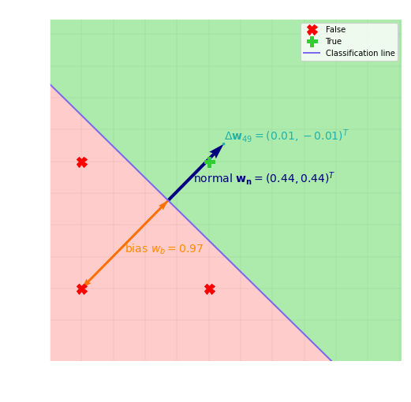


### Logical XOR Problem


```python
targets_xor = [False,
               True,
               True,
               False]

ax = get_figure()
plot_problem(ax, data, targets_xor, title='Logical XOR')
plt.show()
```


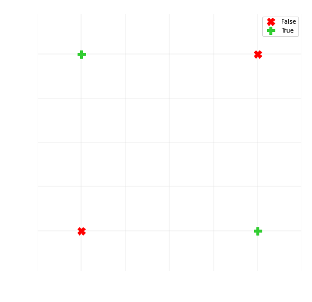

Problem - cannot linearly seperate data with our network.
